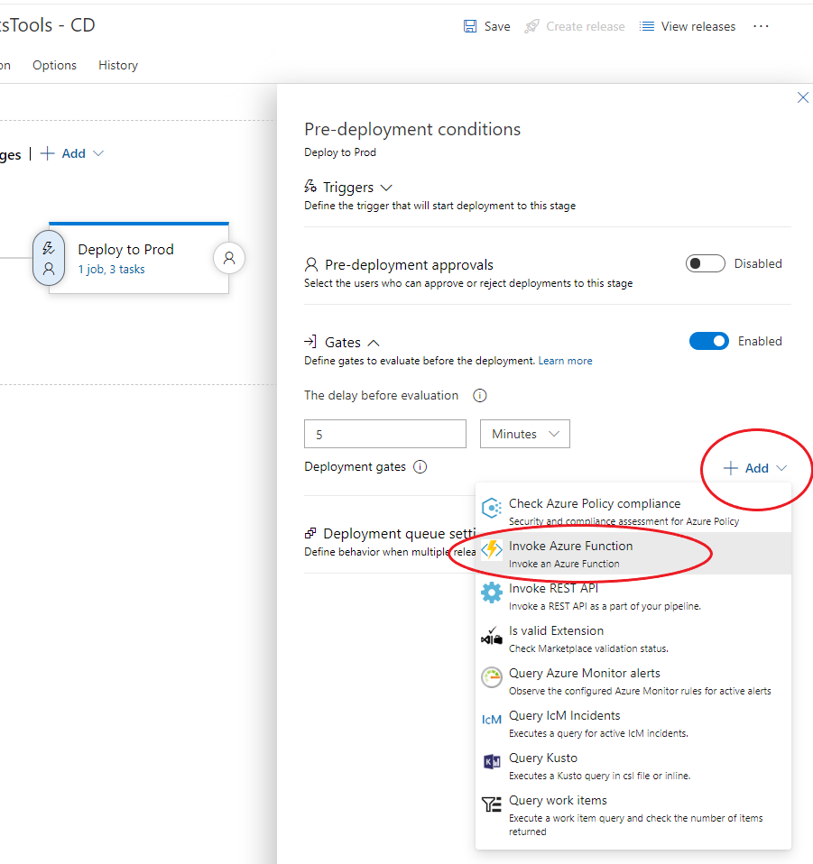
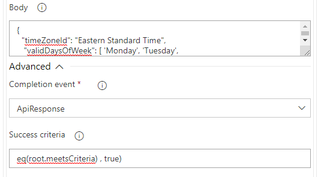

# Azure DevOps Time based deployment gates

## Motivation

In our engineering system we often have CI/CD pipelines in Azure DevOps and frequently use the “Auto-Complete” feature on our pull requests.
These two features combine might result in a deployment when no one around which we generally try to avoid.

### Azure DevOps allows you to Control Deployments using gates.

See: https://docs.microsoft.com/en-us/azure/devops/pipelines/release/approvals/gates?view=azure-devops

## High Level Design.

Create a re-usable azure function which can be shared with multiple pipelines.
Each pipeline owner can pass settings to the function about when the team believes is a safe time to deploy.

All of the settings are configured at the pipeline level. This allows you to deploy the Azure Function once and have multiple pipelines target it and share the resource.

### Examples of gates this project enables:

#### Example 1. Only deploy on Monday thru Friday  

```javascript
POST:

{  
  "timeZoneId": "Eastern Standard Time",  
  "validDaysOfWeek": [ 'Monday', 'Tuesday', 'Wednesday','Thursday','Friday' ]
}
```

#### Example 2: Only deploy during business hours

```javascript
POST:
{
  "startTimeSpan": "9:00",
  "endTimeSpan": "5:00",
  "timeZoneId": "Eastern Standard Time"
}
````

#### Example 3: Do not deploy on Company Holidays Or other days of the year.

```javascript
POST
{
  "timeZoneId": "Eastern Standard Time",
  "invalidDates": ['1/1/2019', '12/25/2019']
}
````

#### Example 4: All of the above in a single Deployment Gate  

```javascript
POST
{
  "timeZoneId": "Eastern Standard Time",
   "validDaysOfWeek": [ 'Monday', 'Tuesday', 'Wednesday','Thursday','Friday' ],
  "startTimeSpan": "9:00",
  "endTimeSpan": "17:00",
  "invalidDates": ['1/1/2019', '12/24/2019',  '12/25/2019', '9/2/2019', '11/28/2019', '11/29/2019']
}
````


### Part 1: The Azure Function

Build and deploy the Publish the  DeploymentGate project to your Azure subscription.

### Part 2: Edit your Release Pipeline



Enter the Function url and the function Key

In the body field: Pass your configuration settings 

````javascript
{
  "timeZoneId": "Eastern Standard Time",
   "validDaysOfWeek": [ 'Monday', 'Tuesday', 'Wednesday','Thursday','Friday' ],
  "startTimeSpan": "9:00",
  "endTimeSpan": "5:00",

  "invalidDates": ['1/1/2019', '12/25/2019']
}
````

or use one of the other examples above.


Under Advanced.  Be sure to put.
eq(root. SuccessCriteria, true)

Save and test your pipeline.
